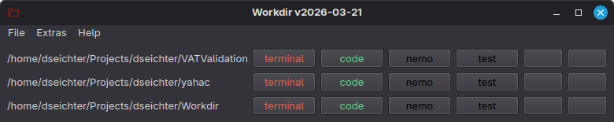

# Workdir

Workdir helps you work with multiple directories and run commands without manually navigating to each location.

Binaries for Windows and Linux are available (see [releases](https://github.com/dseichter/Workdir/releases)).

## Features

- Manage many directories from one UI
- Configure up to six commands per directory
- Use confirmation prompts for sensitive commands
- Attach additional environment variables for execution
- Reuse Workdir with multiple independent configurations

## Installation and Configuration

Download the [latest release](https://github.com/dseichter/Workdir/releases) into a destination folder of your choice and start the program.

Via the configuration (menu Extras) you can specify your directories and store up to six commands.

Please always specify the directories using the placeholder `{directory}`. This value is replaced automatically when commands are executed.

## Known Issues

If you run Workdir the first time, the window can be very small. The size is automatically adjusted based on your configured directories.
