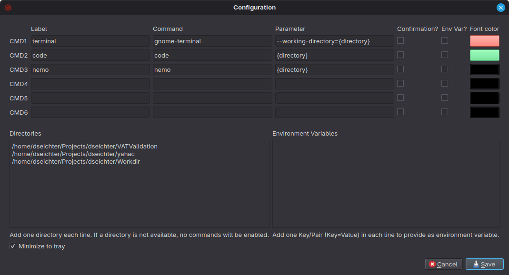

# Installation and Configuration

Download the [latest release](https://github.com/dseichter/Workdir/releases) into a destination folder of your choice and start the program.

Via the configuration (menu Extras) you can specify your directories and store up to six commands.

Please note that in the current version you can only specify the directory itself as a placeholder. The examples for CMD and Windows Explorer should help you to implement your own calls. Once you click Save, the commands and directories are immediately available in the Directories tab.

For commands that you do not want to start by mistake, the program gives you, via the Confirmation option, a prompt to display. Here you will be shown a dialog before each execution, which you must confirm before the command is actually executed.

Please always specify the directories using the variable `{directory}`. This will be replaced and assembled accordingly when the commands are executed. Of course you can also specify executable files or shell scripts which will be called accordingly.

You can also specify additional environment variables. They will be added to your default ones.

## Multiple Configurations

Workdir can be used multiple times. Create a subfolder each time, which you name `Development` or `Projects`, for example. Copy the application file into these directories. When you start the program, it will check if there is already a configuration there (if not, the program will create it automatically).

Now you can define different commands, independent of the category. For example, opening or updating (git pull) directories with source code, or automatic generation of thumbnails and file conversions.
