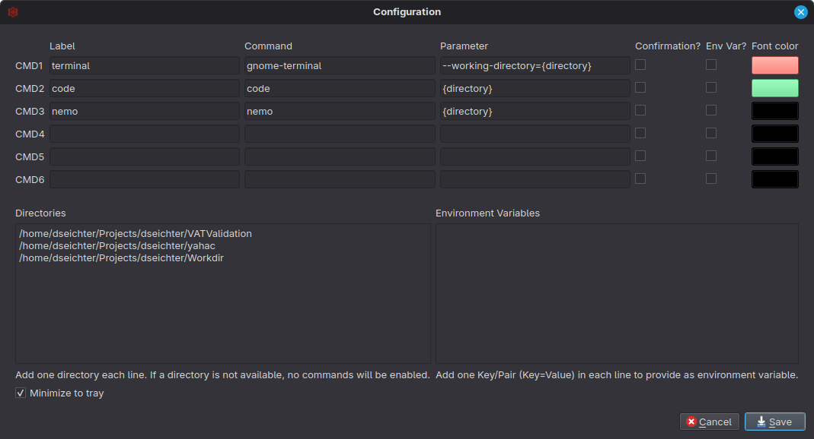

# Installation and Configuration

Download the [latest release](https://github.com/dseichter/Workdir/releases) into a destination folder of your choice and start the program.

## Linux Package Installation (Recommended)

```bash
# Debian/Ubuntu/Mint - installs dependencies automatically
sudo apt install ./workdir_*.deb

# Arch/Manjaro (AUR)
yay -S workdir-bin

# Fedora/openSUSE/RHEL (RPM-based)
sudo rpm -i workdir-*.rpm
```

Via the configuration (menu Extras) you can specify your directories and store up to six commands.



Please note that in the current version you can only specify the directory itself as a placeholder. The examples for CMD and Windows Explorer should help you to implement your own calls. Once you click Save, the commands and directories are immediately available in the Directories tab.

For commands that you do not want to start by mistake, the program gives you, via the Confirmation option, a prompt to display. Here you will be shown a dialog before each execution, which you must confirm before the command is actually executed.

Please always specify the directories using the variable `{directory}`. This will be replaced and assembled accordingly when the commands are executed. Of course you can also specify executable files or shell scripts which will be called accordingly.

You can also specify additional environment variables. They will be added to your default ones.

Configuration is stored per user profile at `~/.workdir/config.json` (on Windows this resolves to your user home, e.g. `C:\\Users\\<user>\\.workdir\\config.json`). It is no longer stored next to the binary.

## Tray behavior

Workdir provides a system tray icon.

- If **Minimize to tray** is enabled in Configuration, minimizing the window hides Workdir to the tray.
- Each directory has a submenu with all the configured commands.

## Multiple Configurations

Workdir uses one configuration per user profile. Running the binary from different folders uses the same configuration automatically.
